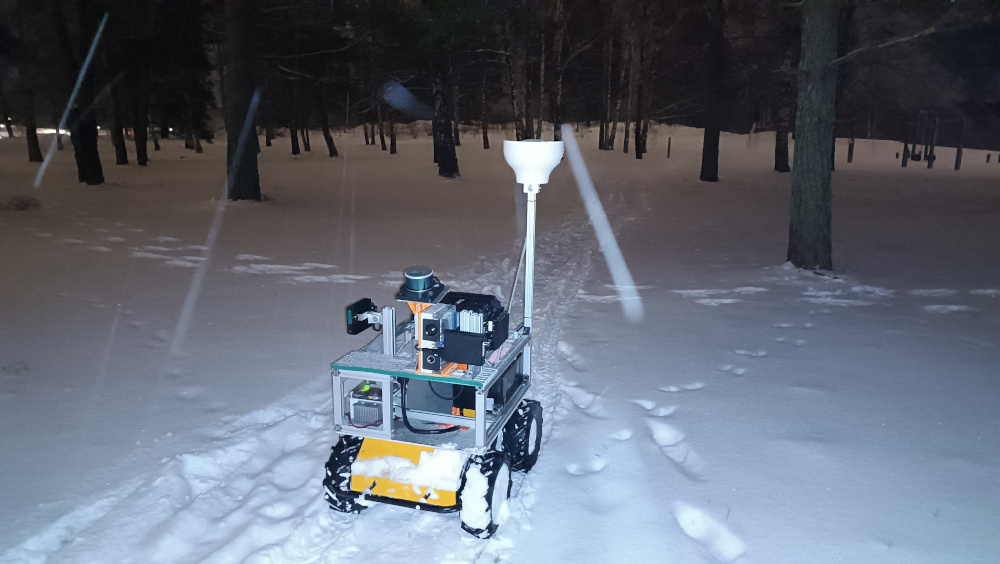
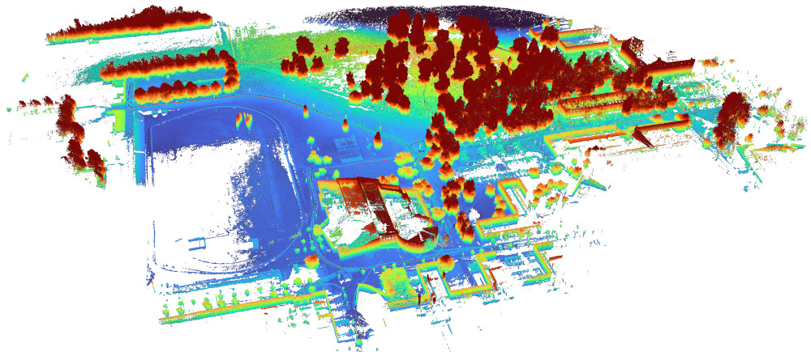
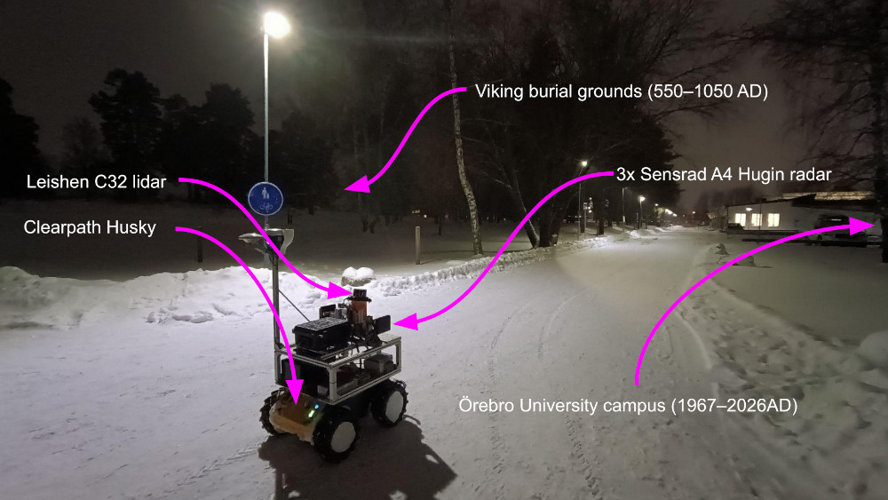
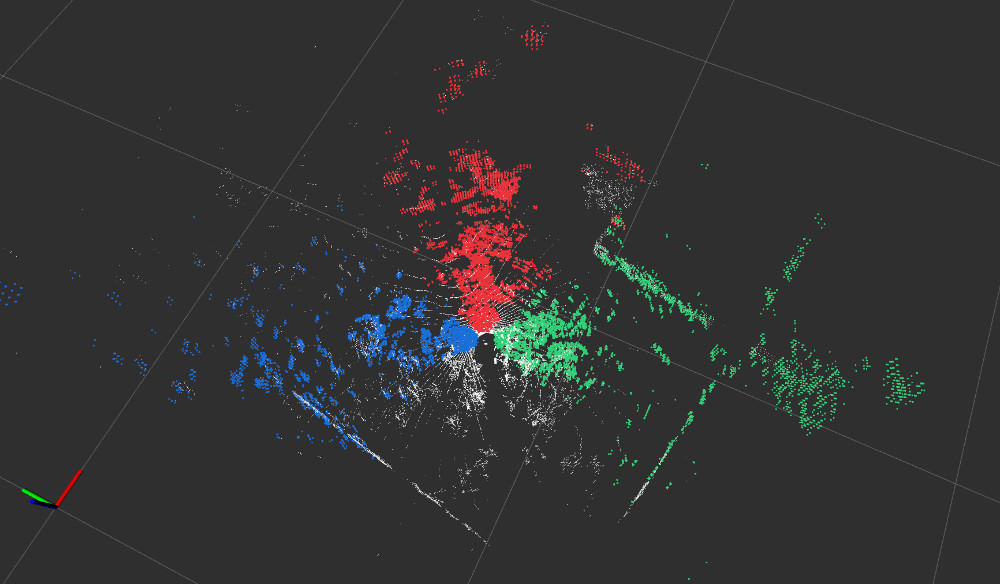
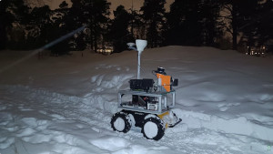

### 📚 Table of Contents

* [Dataset Description](#dataset-description)
* [Dataset Parts](#dataset-parts)
* [Data Structure and File Organization](#data-structure-and-file-organization)
* [Downloads](#downloads)
* [Examples and Teasers](#examples-and-teasers)
* [Acknowledgement](#acknowledgement)

# Örebro 4D-radar SLAM Challenge Data [UNDER CONSTRUCTION]


## Dataset description

*The recorded track captures the [Enbuskabacken](https://www.lansstyrelsen.se/orebro/besoksmal/kulturmiljoer/enbuskabacken.html) and the neighboring university campus in Örebro.*

This dataset serves as the training and competition track in the 4D-radar SLAM challenge organized by the [Radar in Robotics: New Frontiers](https://sites.google.com/view/radar-robotics/home) workshop at the [ICRA 2026](https://2026.ieee-icra.org/workshops-and-tutorials/) conference.
The dataset consists of two trajectories driven with a Husky robot through a forested area (approx. 200x200m) and the neighbouring Örebro university campus.
It was recorded in January 2026. The terrain in the forrested area is uneven because it used to serve as a burial ground during the Viking Age (550-1050 AD). Even the campus portion of the trajectory involves climbing up some inclined paths and sloped terrain.
The dataset includes a liDAR, three 4D radar sensors, a GNSS reference, an RGB camera and an IMU.
In the training run, all data are provided. In the competition run, only the radars and IMU are available.

---

## Dataset Parts
### Public Training Part

* **01_campus_training_localized** (2257s)
1.8km-long trajectory that covers both the natural and urban environment at the campus. Its shape was chosen as to offer several opportunities for loop closure.


*The reference lidar map for the training run, created using the GLIM SLAM package.*  

### Hidden Testing Part

* **02_campus_eval_filtered** (3813s)
2.6km-long track that covers the same environment. It also allows several loop closures. From this run, we provide only the radar and IMU data. The competition SLAM systems must be able to localize and map using only these two modalities.
 
---

## Data Structure and File Organization

```
├── calibration
│   ├── frames_overview.pdf
│   ├── hugin_a4_radar_startup_params.txt
│   └── static_tfs.launch.xml
└── data
    ├── 01_campus_training_localized
    │   ├── gps
    │   │   └── ReachRoverO_solution_20260120122238.LLH
    │   ├── reference_map
    │   │   └── 01_map.ply
    │   └── rosbag
    │       └── 01_campus_training_localized
    │           ├── metadata.yaml
    │           ├── racoon_2026_01_28_17h_34m_30s_0.mcap
    │           ├── racoon_2026_01_28_17h_34m_30s_10.mcap
    │           ├── racoon_2026_01_28_17h_34m_30s_11.mcap
    │           ├── racoon_2026_01_28_17h_34m_30s_1.mcap
    │           ├── racoon_2026_01_28_17h_34m_30s_2.mcap
    │           ├── racoon_2026_01_28_17h_34m_30s_3.mcap
    │           ├── racoon_2026_01_28_17h_34m_30s_4.mcap
    │           ├── racoon_2026_01_28_17h_34m_30s_5.mcap
    │           ├── racoon_2026_01_28_17h_34m_30s_6.mcap
    │           ├── racoon_2026_01_28_17h_34m_30s_7.mcap
    │           ├── racoon_2026_01_28_17h_34m_30s_8.mcap
    │           └── racoon_2026_01_28_17h_34m_30s_9.mcap
    └── 02_campus_eval_filtered
        └── rosbag
            └── 02_campus_eval_filtered
                ├── 02_campus_eval_filtered_0.mcap
                ├── 02_campus_eval_filtered_1.mcap
                ├── 02_campus_eval_filtered_2.mcap
                ├── 02_campus_eval_filtered_3.mcap
                ├── 02_campus_eval_filtered_4.mcap
                ├── 02_campus_eval_filtered_5.mcap
                ├── 02_campus_eval_filtered_6.mcap
                ├── 02_campus_eval_filtered_7.mcap
                └── metadata.yaml
```

* `rosbag` → ROS2 Jazzy bagfile version, using mcap as the storage format.
* `gps/` → Reference RTK trajectory, as obtained from the Emlid Reach RS2+ receiver.
* `reference_map/` → Reference lidar map exported from the GLIM SLAM package. This map was used together with the Norlab ICP Mapper to populate the `map` → `odom` transform in the training run.
* `calibration/` → Transformations between sensor frames and the Hugin radar settings. TFs provided as a ROS2 launch file for convenience.

### Sensors
The dataset provides sensor measurements from these sensors:

* Sensrad Hugin A4-Sample (solid-state 4D radar, three units covering 3x90°)
  * The sensor message is a point cloud which includes the power and doppler values in each point.
  * Each of the three radar sensors is free-running -- the point clouds are NOT triggered together. Inspect the provided bag files with `rtk_bag` command. The time stamps are generated onboard the radars, based on initial sync with the ROS drivers. We leave it to the contestants to develop sync/grouping approaches to benefit from the wide field of view of this setup.
  * **Please note** that the Hugin A4-Sample radar used in our dataset is a demo, pre-production model not with the same performance as the forthcoming production-ready model. 
  * Topic: `/hugin_[1,2,3]/radar_data`
* Leishen C32 (3D lidar)
  * This sensor is available for tuning and verification of your SLAM solution, but not available in the competition run. Motion-deskewed pointcloud (based on IMU and wheel odometry) is provided for convenience as well (yet keep in mind that some lidar SLAM packages expect skewed point cloud.)
  * Topics: `/cx/lslidar_point_cloud`, `/cx/lslidar_point_cloud_deskewed`
* Xsens MTi-30 (IMU)
  * Topics: `/imu/data`, `/imu/mag` 
* Emlid Reach RS2+ (RTK-GNSS receiver pair)
  * Topics from the receiver (RTK mode): `/emlid_gnss/fix`, `/emlid_gnss/nmea_sentence`, `/emlid_gnss/time_reference`, `/emlid_gnss/vel`
* Husky odometry fused with the Xsens MTi-30 IMU
  * Topic: `/a200_1750/platform/cmd_vel` (teleoperation commands), `/a200_1750/platform/odom` (pure odom), `/imu_odom` (our fused imu-odometry)
* Reference localization w.r.t. the provided reference point cloud map
  * Topic: `/icp_odom` (expresses the pose of the /base_link in /map)
  

*The Husky robot equipped with the dataset sensors.*


*The three Hugin radar sensors cover 270° -- left, front, right.*

### Reference Contents

The dataset contains reference localization for the training run:

* `gps/ReachRoverO_solution_20260120122238.LLH`: Reference GNSS RTK localization. The robot is synchronized with the GPS time. The contents of this file are duplicated in the bag files in `/emlid_gnss/fix` as well (with a lower sampling rate though).
* `reference_map/01_map.ply`: Point-cloud map produced by the GLIM SLAM. Although the GPS was not used as an aiding source, we have verified that the trajectory in this map aligns with the RTK gps, with errors lower than 10cm. Keep in mind that the competition will be evaluated againts the RTK GPS.
* `/icp_odom` and `/tf`: Lidar localization in the reference lidar map. The lidar localization is expressed as the `map` → `odom` transform in the `/tf` topic. The `odom` → `base_link` is a fusion of IMU and wheel odometry we used for reference lidar localization. We suggest filtering these two transforms away when developping radar-based odometry for the competition. We provide a simple Python [script](tools/filter_frame_from_tf.py) for filtering selected frames from a ROS2 bag file. Note that only raw IMU data are provided in the competition run.

---

## Downloads

The dataset can be accessed file-by-file at this [repository](https://cloud.oru.se/s/y8fLYsxfFRSoH4z)

As there are many files, many of them large, therefore we also provide a compressed version. 
The dataset was compressed using the **7z** tool, make sure to have it installed in your system for the decompression. 
For convenience, consider using the provided bash download script. It downloads and decompresses the archive at the location of running it. 
To download the archive and decompress it you need 57GB+65GB of free HDD space. 

* [Download script](tools/download_and_decompress.bash)

---

## Video Teaser

[](https://youtu.be/7EUJzRvgR3k)

## Acknowledgement

The dataset was labelled using the online tools from [Segments.ai](https://segments.ai) who generously provided us a free academic license.

* Segments.ai (2023). Segments.ai data labeling platform, [https://segments.ai](https://segments.ai).

The reference map was constructed using the [GLIM](https://github.com/koide3/glim) and localization was obtained by using Norlab's [ICP Mapper](https://github.com/norlab-ulaval/norlab_icp_mapper_ros)

* Koide et al., "GLIM: 3D Range-Inertial Localization and Mapping with GPU-Accelerated Scan Matching Factors", Robotics and Autonomous Systems, 2024, [[DOI]](https://doi.org/10.1016/j.robot.2024.104750) [[Arxiv]](https://arxiv.org/abs/2407.10344)

* Pomerleau, F., Colas, F., Siegwart, R., & Magnenat, S. (2013). Comparing ICP Variants on Real-World Data Sets. Autonomous Robots, 34(3), 133–148. 


The work on this dataset was supported by the European Union's Horizon Europe Framework Programme under the RaCOON project (ID: 101106906).


